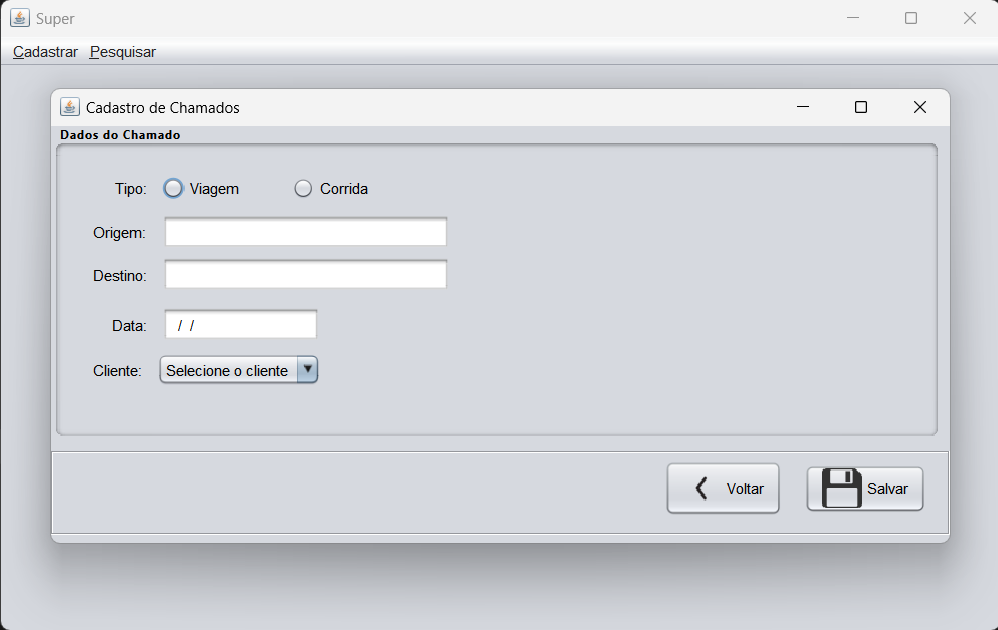

### Super
This Java-based application serves as a prototype for an urban transportation system. Designed primarily for training purposes with the Ant build tool. It uses the Swing GUI library to provide a user-friendly interface for:
 - Client registration
 - Client search, edit, and deletion
 - Ride management (creation, modification, deletion)

#### Running the Aplication
```
java -jar dist/Super.jar
```



